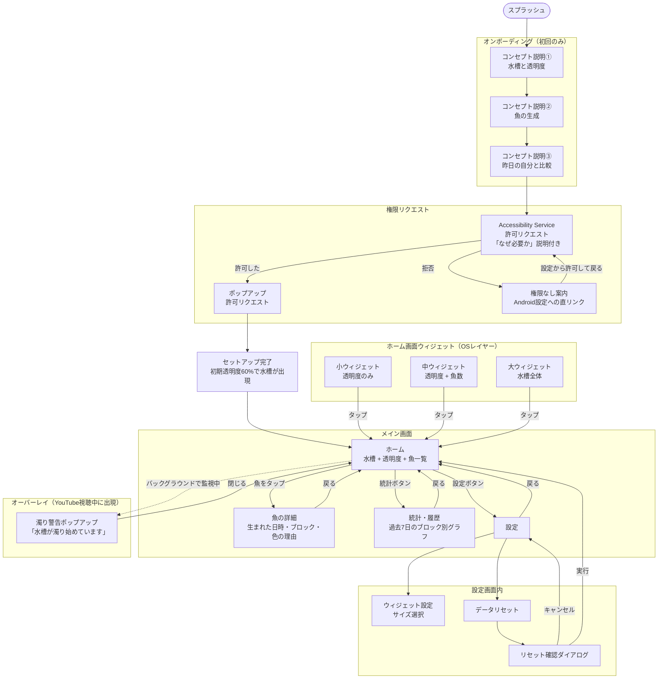

# 画面遷移図 — Clear World

**作成日:** 2026-03-22

---

## 画面一覧

| カテゴリ | 画面名 |
|---|---|
| 初回起動 | スプラッシュ、オンボーディング（3枚）、権限リクエスト（Accessibility / ポップアップ）、セットアップ完了 |
| メイン | ホーム（水槽）、魚詳細、統計・履歴 |
| 設定 | 設定トップ、ウィジェット設定、データリセット確認 |
| オーバーレイ | 濁り警告ポップアップ |
| ウィジェット | 小・中・大（OSレイヤー） |

---

## 画面遷移図（Mermaid）

---

## 補足事項

- **魚誕生の演出:** アニメーション専用画面なし。ブロック終了時にウィジェットが静かに更新される。アプリを開いたとき、すでに魚が増えている体験を重視。
- **権限拒否時:** ハードゲート。Android設定画面への直リンクを表示し、許可するまでアプリを使用不可とする。
- **魚の墓地:** 実装しない（v1スコープ外）。
